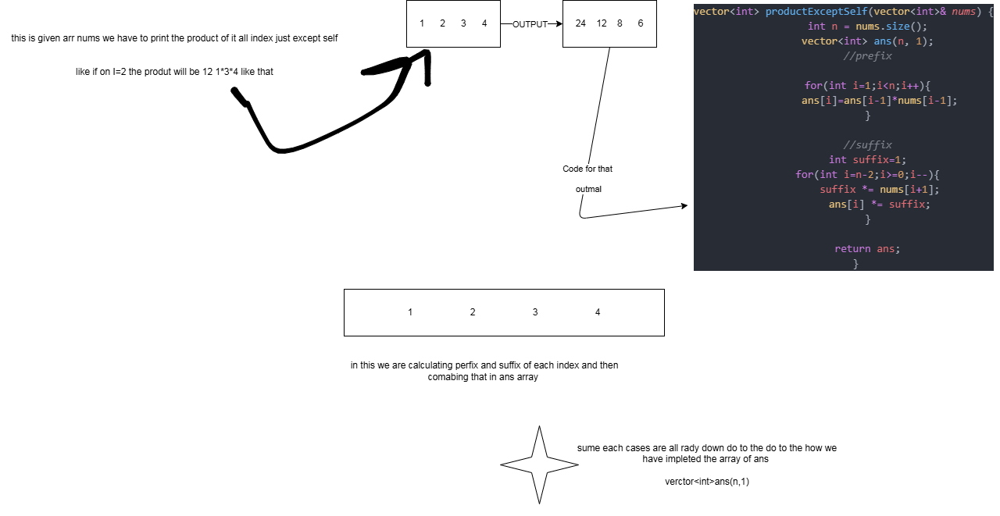

# 238 leetcode


this is most optimal sulaution


```c++
vector<int> productExceptSelf(vector<int>& nums) {
        int n = nums.size();
        vector<int> ans(n, 1);
        //prefix

        for(int i=1;i<n;i++){
            ans[i]=ans[i-1]*nums[i-1];
        }

        //suffix
        int suffix=1;
        for(int i=n-2;i>=0;i--){
            suffix *= nums[i+1];
            ans[i] *= suffix;
        }

        return ans;
    }
```

this is now it was impleted





now this problem have lot of thing like we have to find out product of given array elements but not the element at "i" this was hard do to we have to find out perfix and suffix then * them to get ans 

